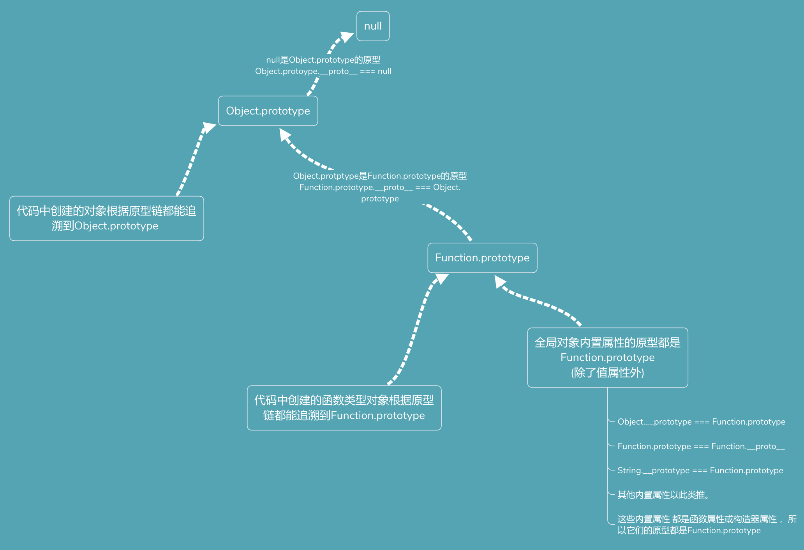

# 原型

在设计模式中，有一种创建型设计模式，叫做 **原型模式**。 其特点在于通过「复制」一个已经存在的实例来返回新的实例,而不是新建实例。 被复制的实例就是我们所称的**「原型」**，这个原型是可定制的。

原型模式同时也是一种编程范式，称之为**原型编程**。原型编程是面向对象编程的一种风格。Java、C++等是基于类编程的语言，也是面向对象编程的一种风格。
（ES6推出的新特性 类语法只是一种语法糖，本质上都是基于原型编程）

JavaScript就是基于原型编程的语言。

### JavaScript中原型是什么？

在JavaScript中每个实例对象都有一个 私有属性 `__proto__`, 指向这个实例对象的构造函数的`prototype`属性。`prototype`属性就是原型模式中哪个被复制的实例，我们称之为原型。

### 什么是原型链？

`prototype`属性也是一个对象，它也有一个 `__proptp__`属性，这样层层向上直到一个对象的原型对象（`prototype`）是null。
根据定义，null没有原型，并作为原型链中的最后一个环节。

### JS内置对象的原型

> 只有通过function关键字显示定义的函数对象， 才会默认带有prototype属性，此属性中默认存在constructor和__proto__属性

### 实现继承

> 待补充
