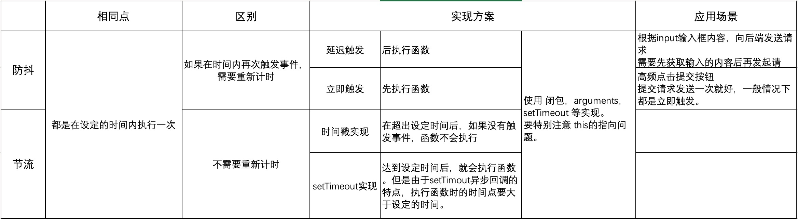

# 防抖和节流

[TOC]

## 为什么会使用到防抖或节流？
某些事件会被频繁的触发，也就会频繁的执行事件函数，导致页面卡顿，浪费性能和内存。
比如 scroll，input输入，resize这些事件。

### 在项目中使用到的情况

#### Node环境下的I/O操作
在ydap-transpiler项目中 实现文件删除后，要更改manifest.json中存储的键值对。多个文件删除就要有多次写入的操作。所以针对写入操作 使用了延迟触发方式的防抖，达到减少写入操作的次数。

## 防抖和节流对比


## 防抖实现

### 延迟触发
#### 方案1

```js
function debounce(func, wait) {
  let timeout;
  return function () { // 注意此处不要使用箭头函数，避免this指向了调用debounce的实例，而不是真正调用func的对象。
    if (timeout) clearTimeout(timeout);
    timeout = setTimeout(() => {
      // 使用箭头函数, 避免func函数体中使用到this时，造成的this指向错误问题。
      func.apply(this, arguments);
    }, wait)
  }
}
```

#### 方案2：

```js
function debounce(func, wait) {
  let timeout;
  return function () {
    let context = this;
    let args = arguments;
    if (timeout) clearTimeout(timeout);
    timeout = setTimeout(function() {
      // 在闭包中要特别注意this和arguments
      func.apply(context, args);
    }, wait)
  }
}
```

### 立即触发

```js
function debounce(func, wait) {
  let timeout;
  return function () {
    if (timeout) clearTimeout(timeout);
    else func.apply(this, arguments);
    // 开始计时 或者 重新计时
    timeout = setTimeout(() => {
      timeout = null;
    }, wait);
  }
}
```

## 节流实现

### 时间戳实现

```js
function throttle(func, wait) {
  let start = 0;
  return function() { 
    const now = Date.now();
    if (now - start > wait) { //利用时间戳计算, 延迟到设定的时间后才执行真正的操作.
      func.apply(this, arguments);
      // 重置起始时间戳
      start = now;
    }
  }
}
```


### setTimeout实现

```js
function throttle(func, wait) {
  let timeout;
  return function () {
    // timeout不为空说明已经开始计时
    if (timeout) return;
    // 否则开启定时
    timeout = setTimeout(() => {
      func.apply(this, arguments);
      timeout = null;
    }, wait);
  }
}
```


