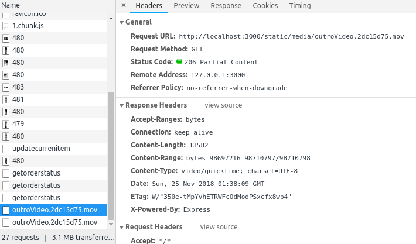
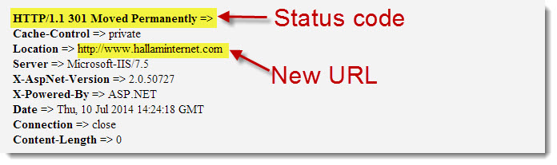

# 简述常见HTTP状态码的含义

## 什么是HTTP状态码？

HTTP状态码是在 请求的 响应体的第一行 协议名称后面，由三位数字组成，数字后面会跟着一个短语，用于简短描述请求结果的状态。

## HTTP状态码主要分为五类
> 以下内容参考 《图解HTTP》
> [MDN HTTP 响应代码](https://developer.mozilla.org/zh-CN/docs/Web/HTTP/Status) 

### 1xx 信息响应
信息性状态码， 表示接收的请求正在处理

### 2xx 成功响应

#### 200 OK
代表从客户端发来的请求在服务器端被正常处理了

#### 204 No Content
请求被服务器端正常处理， 但是不返回任何实体的主体（就是不返回响应体body部分）。
浏览器接收到204状态后，显示的页面不发生更新。

##### 场景
	一般在 客户端只需要向服务器端发送信息，但是不需要接收服务器端返回的信息时使用。
	
#### 206 Partial Content
表示客户端进行了范围请求， 而服务器成功执行了这部分的GET请求。
范围是根据请求的Range字段指定的
响应报文中包含由Content-Range指定范围的实体内容。

##### 场景
**断点续传**
* 类似于 FlashGet 或者迅雷这类的 HTTP 下载工具都是使用此类响应实现断点续传
* 将一个大文档分解为多个下载段同时下载。

### 3xx 重定向响应

3xx开头的状态码代表浏览器需要执行某些特殊的操作，以正确处理请求

#### 301 Moved Permanently
永久性重定向, 表示请求的资源已经被分配了新的URI。

* 新的URI会在响应头的`Location`字段中。
* 同时浏览器会更新保存在书签中的URI。

#### 302 Found
临时性重定向
表示请求的资源已经分配了新的URI，希望用户（本次）能使用新的URI访问。
* 新的URI会在响应头的`Location`字段中。
* 浏览器会重定向到`Location`字段指定的URI， 但是搜索引擎不会对该资源的链接进行更新

> **和301的区别**
> 	 302代表只是临时性的移动了资源，将来资源的URI还可能会发生变化

#### 303 See Other

* 通常作为 PUT 或 POST 操作的返回结果，
* 表示重定向链接指向的不是新上传的资源，而是另外一个页面，比如消息确认页面或上传进度页面。
* 而请求重定向页面的方法要总是使用 GET。

> **和302的区别**
> 	期望浏览器使用GET方法访问另一个URI.

#### 304 Not Modified
表示请求的资源在服务器端没有发生改变，可以直接使用客户端缓存。

通常请求头中会携带一些条件字段：cache-control: max-age=893333,  If-None-Match, If-Modified-Since等
当服务器端判断不符合这些条件，但是资源未发生改变的时候将会返回304状态码。（如果符合这些条件会返回200状态码）

#### 307 Temporary Redirect
临时重定向（和302有相同的含义）

> 状态码 307 与 302 之间的唯一区别在于
>   当发送重定向请求的时候，307 状态码可以确保请求方法和消息主体不会发生变化。
> 	  如果使用 302 响应状态码，一些旧客户端会错误地将请求方法转换为 GET
> 
> 也就是说，在 Web 中，如果使用了 GET 以外的请求方法，且返回了 302 状态码，则重定向后的请求方法是不可预测的；但如果使用 307 状态码，之后的请求方法就是可预测的。对于 GET 请求来说，两种情况没有区别。
> 

> 与303使用的区别
> 在确实需要将重定向请求的方法转换为 GET 的场景下，可以考虑使用 303 See Other 状态码

### 4xx
4开头的状态码代表客户端发生了错误

#### 400 Bad Request
表示请求的报文中存在语法错误。

#### 401 Unauthorized
表示发送的请求需要通过HTTP认证（BASIC认证，DIGEST认证）的认证信息。 
初次接收到401响应，浏览器会弹出认证用的对话窗口 
若之前已经进行过一次请求，则表示用户认证失败 

#### 403 Forbidden
表示请求资源的访问被服务器拒绝了

场景：
Nginx上的目录没有读取权限时会返回403

#### 404 Not Found
表示在服务器上无法找到请求的资源。

### 5xx
5开头的状态码表示服务器端发生了错误

#### 500 Internal Server Error
* 服务器端在执行请求时发生了错误
* Web应用存在Bug （这里的Web应用应该是指服务器端的）
* 某些临时的故障

#### 503 Service Unavailable
表名服务器暂时处于超负载或正在进行停机维护，现在无法处理请求

